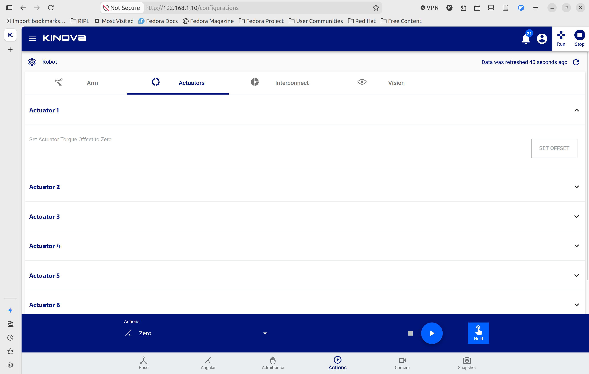
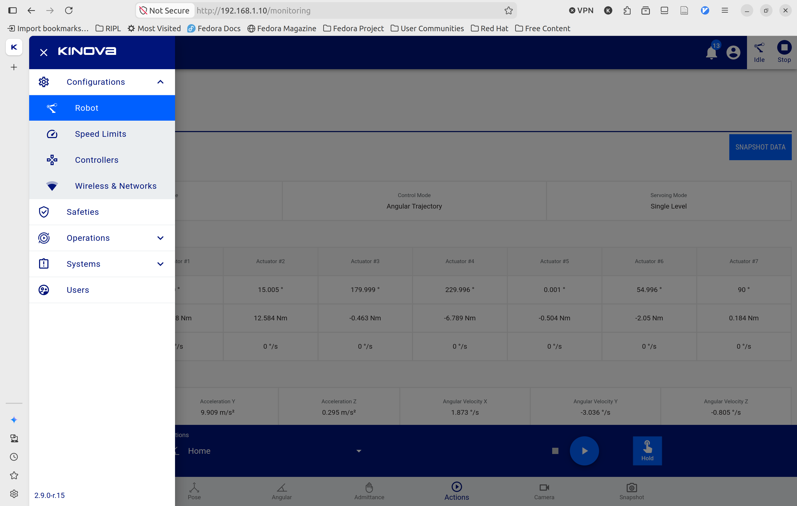
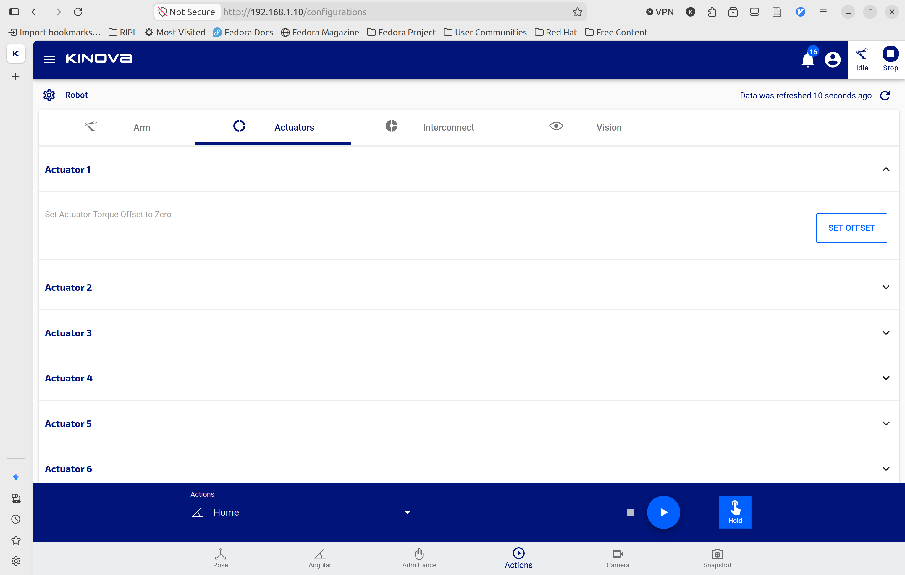
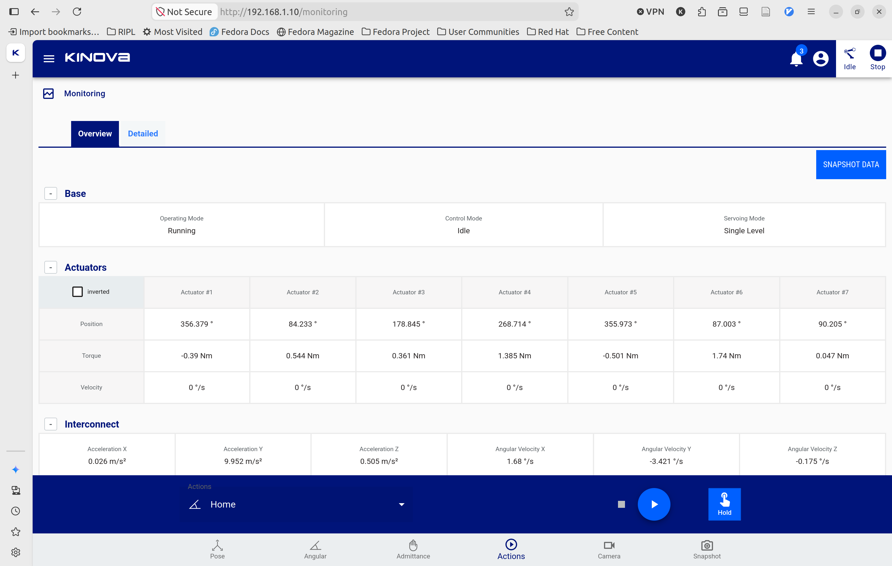
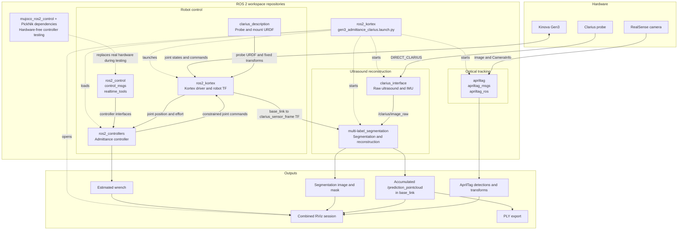

# ROS 2 KINOVA KORTEX™
> Kinova® KINOVA KORTEX™ is the common software platform behind all of the products in the Gen3 family (Gen3 and Gen3 lite). It unifies the inner workings of the various robots and their related external tools, like the API. <br />
> https://www.kinovarobotics.com/product/gen3-robots

<center></center>

ROS2 KINOVA KORTEX™ is the official ROS2 package to interact with KINOVA KORTEX™ and its related products. It is built upon the KINOVA KORTEX™ API, documentation for which can be found in the [GitHub Kortex repository](https://github.com/Kinovarobotics/kortex).

## Build status

<table width="100%">
  <tr>
    <th>ROS 2 Distro</th>
    <th>Humble</th>
    <th>Jazzy</th>
    <th>Rolling</th>
  </tr>
  <tr>
    <th>Branch</th>
    <td><a href="https://github.com/Kinovarobotics/ros2_kortex/tree/humble">humble</a></td>
    <td><a href="https://github.com/Kinovarobotics/ros2_kortex/tree/jazzy">jazzy</a></td>
    <td><a href="https://github.com/Kinovarobotics/ros2_kortex/tree/main">main</a></td>
  </tr>
  <tr>
    <th>Build Status</th>
    <td>
      <a href="https://github.com/Kinovarobotics/ros2_kortex/actions/workflows/humble-binary-build.yml">
        
      </a>
      <br/>
      <a href="https://github.com/Kinovarobotics/ros2_kortex/actions/workflows/humble-source-build.yml">
        
      </a>
    </td>
    <td>
      <a href="https://github.com/Kinovarobotics/ros2_kortex/actions/workflows/jazzy-binary-build.yml">
        
      </a>
      <br/>
      <a href="https://github.com/Kinovarobotics/ros2_kortex/actions/workflows/jazzy-source-build.yml">
        
      </a>
    </td>
    <td>
      <a href="https://github.com/Kinovarobotics/ros2_kortex/actions/workflows/rolling-binary-build.yml">
        
      </a>
      <br/>
      <a href="https://github.com/Kinovarobotics/ros2_kortex/actions/workflows/rolling-semi-binary-build.yml">
        
      </a>
      <br/>
      <a href="https://github.com/Kinovarobotics/ros2_kortex/actions/workflows/rolling-source-build.yml">
        
      </a>
    </td>
  </tr>
  <tr>
    <th>Release Status</th>
    <td>Stable (binary available — may lag behind source)<!-- TODO(moriarty) add build.ros2.org status badge once released --></td>
    <td>Stable (source only)<!-- TODO(moriarty) add build.ros2.org status badge once released --></td>
    <td>Unstable (source only)</td>
  </tr>
</table>


**Note:** There are several CI jobs checking against future upstream changes see [detailed build status](.github/workflows/README.md) for a full list of CI jobs and for more information.

**Note:** Gazebo classic support was kept on the `humble` branch of this repository

---

## Usage

### Hardware Setup

#### Kinova Gen 3

1. Connect the power cable to the robot and an Ethernet cable to your laptop
2. Replace the Robotiq gripper with Clarius scanner by removing the 4 screws
3. Power up the robot by holding the power button until seeing the green light
4. Wait for around 30 second, then open [Kinova Web Interface](http://192.168.1.10/)
5. Ensure the surround environment for robot is clean and empty
6. In the web interface, run zero pose from the action on the bottom

  

7. Go to robot and set the torque on each joint to be zero

  

  

8. Run retract pose from the action on the bottom

  

#### Clarius

1. Unlock the tablet using `WESTL25!`
2. Open Clarius app
3. Turn on Clarius by pressing the power button
4. Connect Clarius to the tablet
5. Ensure IMU is turned on

#### Realsense

1. Connect the RealSense camera to the laptop

### Software Setup

#### First Time Used

1. Install Docker Engine following this [instruction](https://docs.docker.com/engine/install/) and ensure the user to run Docker

	```bash
	sudo usermod -aG docker "$USER"
	```

2. Configure the host so Clarius Wi-Fi and robot Ethernet work together.
	- The robot is at `192.168.1.10` over Ethernet and the Clarius probe is at `192.168.1.1` over `DIRECT_CLARIUS`
	- Because both are on the `192.168.1.0/24` subnet, use a host route for each device
	- Follow these steps while Ethernet remains connected
	- Replace the example interface and connection names with the values shown by:

		```bash
		nmcli -f NAME,TYPE,DEVICE connection show --active
		ip -br address
		```

	1. Connect to the Clarius Wi-Fi:

		```bash
		nmcli connection up DIRECT_CLARIUS
		```

	2. Add a route for each device to the correct interface:

		```bash
		sudo ip route replace 192.168.1.1/32 dev wlp0s20f3
		sudo ip route replace 192.168.1.10/32 dev enx68da73a52630
		```

	3. Confirm Clarius traffic uses Wi-Fi:

		```bash
		ip route get 192.168.1.1
		```

	It should contain:

		```text
		dev wlp0s20f3
		```

	4. Confirm robot traffic still uses Ethernet:

	```bash
	ip route get <ROBOT_IP>
	```

	It should contain:

	```text
	dev enx68da73a52630
	```

	Replace `<ROBOT_IP>` with the robot arm’s actual address.

	5. Once confirmed working, make both routes persistent. Replace `"Wired connection 1"` with the Ethernet connection name reported by `nmcli`:

	```bash
	sudo nmcli connection modify DIRECT_CLARIUS ipv4.never-default yes
	sudo nmcli connection modify DIRECT_CLARIUS +ipv4.routes "192.168.1.1/32"
	sudo nmcli connection modify "Wired connection 1" ipv4.never-default yes
	sudo nmcli connection modify "Wired connection 1" +ipv4.routes "192.168.1.10/32"
	sudo nmcli connection up "Wired connection 1"
	sudo nmcli connection up DIRECT_CLARIUS
	```

	6. Verify again:

	```bash
	ip route get 192.168.1.1
	ip route get <ROBOT_IP>
	```

	The development container uses host networking, so it inherits these routes. Do not use this setup if the robot itself also has IP address `192.168.1.1`; duplicate addresses cannot be reliably routed this way.
3. Make sure [SSH key](https://docs.github.com/en/authentication/connecting-to-github-with-ssh/generating-a-new-ssh-key-and-adding-it-to-the-ssh-agent) has been added to the GitHub and the following repos are being shared
	- [clarius_interface](https://github.com/westlab-uwo/clarius_interface)
	- [clarius_description](https://github.com/ripl-lab/clarius_description)
	- [multi-label_segmentation](https://github.com/westlab-uwo/multi-label_segmentation)
4. Run the following command to clone the repo

	```bash
	mkdir -p ~/workspace/clarius_ws/src
	cd ~/workspace/clarius_ws/src
	git clone git@github.com:ripl-lab/ros2_kortex.git
	```

5. Create a workspace-level directory for rosbag files. Keeping bags outside `src/ros2_kortex` makes them available through the development container's workspace mount without copying them into the Docker image.

	```bash
	mkdir -p ~/workspace/clarius_ws/bags
	```

6. Move the segmentation checkpoint into the model directory. The default configuration expects the checkpoint to be named `unet.pth`.

	```bash
	mkdir -p ~/workspace/clarius_ws/src/multi-label_segmentation/multi_label_segmentation/src/models
	mv ~/Downloads/unet.pth \
		~/workspace/clarius_ws/src/multi-label_segmentation/multi_label_segmentation/src/models/unet.pth
	```

	If the checkpoint is stored somewhere else, replace `~/Downloads/unet.pth` with its actual path.

The host workspace is named `clarius_ws`; the Docker helper mounts it at the fixed internal path `/workspace/ros2_kortex_ws`, so commands run inside the container continue to use that internal path.

#### Build and Run

1. Build and enter the container. The first build may take approximately 10 minutes.

	```bash
	cd ~/workspace/clarius_ws/src/ros2_kortex
	./.devcontainer/dev-docker.sh -- \
    colcon build --cmake-args \
      -DCMAKE_BUILD_TYPE=Release \
      -DDOWNLOAD_UNITREE_H1_ASSETS=OFF \
      --executor sequential
	```

	To skip rebuilding and initializing an existing environment:

	```bash
	./.devcontainer/dev-docker.sh --no-build --no-init
	```

2. Inside the Docker container, you should see a prompt similar to:

	```bash
	(.venv) clarius@user-Yoga-Pro-9-16IMH9:/workspace/ros2_kortex_ws$
	```

3. Launch the Kinova Gen3, Clarius interface, RealSense camera, AprilTag tracking, admittance controller, and RViz:

	```bash
	ros2 launch kortex_bringup gen3_admittance_clarius.launch.py \
		robot_ip:=192.168.1.10 \
		force_test_response:=true \
		start_clarius:=true \
		start_apriltag_tracking:=true \
		launch_realsense:=true \
		vision:=true \
		launch_rviz:=true \
		auto_move_activation_pose:=true \
		constrain_eef_orientation:=true
	```

3. Keep the emergency stop accessible and observe the automatic movement to the activation pose. Confirm that the path and final scanning pose are safe before approaching the robot.
	- The configured activation pose is: [0, 30, 180, 260, 360, 310, 0] degrees
		- If the pose is unsuitable:
		- Stop using the robot emergency stop if immediate motion is unsafe.
		- Otherwise stop the launch with `Ctrl+C`.
		- Move the robot to a safe configuration.
		- Update activation_pose_degrees in: ` src/ros2_kortex/kortex_bringup/scripts/activation_pose_service.py`
		- Rebuild and source the package:

			```bash
			colcon build --packages-select kortex_bringup --symlink-install
			source install/setup.bash
			```

		- To launch without automatically moving the robot:

			```bash
			ros2 launch kortex_bringup gen3_admittance_clarius.launch.py \
				robot_ip:=192.168.1.10 \
				force_test_response:=true \
				auto_move_activation_pose:=false
			```

		- The activation pose can then be requested manually:

			```bash
			ros2 service call /move_to_activation_pose std_srvs/srv/Trigger "{}"
			```

4. To open another shell in the already-running container:

	```bash
	docker exec -it ros2-kortex-dev bash
	```

#### Expected behaviour

1. Initialize the Kinova Gen3, Clarius interface, RealSense camera, AprilTag tracking, admittance controller, and RViz.
2. Automatically switch the host Wi-Fi connection to `DIRECT_CLARIUS`.
3. Read the measured joint positions and move smoothly to the activation scanning pose if needed.
4. Switch from the joint trajectory controller to the admittance controller after reaching the activation pose.
5. Capture the activation-pose orientation as the constrained EEF orientation.
6. Permit force-guided XYZ translation while keeping the scanner orientation fixed.
7. Stop translational movement after the applied force is released and the latch settles.
8. Display the robot, estimated wrench, Clarius image, segmentation result, and RealSense image in one RViz session.
9. When the launch exits normally, attempt to restore the configured Wi-Fi connection.

#### Configurable arguments

- Useful launch arguments include:
	- `use_fake_hardware:=false`: Use the real robot. Set it to true for testing without a connected robot.
	- `force_test_response:=true`: Allow the estimated wrench to command admittance motion. When false, wrench estimation remains active but the robot should not respond to it.
	- `auto_move_activation_pose:=true`: Automatically move to the activation pose during launch.
	- `constrain_eef_orientation:=true`: Keep the activation-pose orientation while allowing XYZ admittance motion.
	- `constrain_eef_z_motion:=true`: Lock base-frame Z translation while retaining X/Y admittance motion.
	- `start_clarius:=true`: Start the Clarius connection and segmentation pipeline.
	- `start_apriltag_tracking:=true`: Start the RealSense and AprilTag tracking pipeline.
	- `launch_realsense:=true`: Start the RealSense camera used by AprilTag tracking.
	- `vision:=true`: Include the Kinova vision configuration.
	- `launch_rviz:=true`: Open the combined RViz session.
	- `admittance_mode:=move_and_stay`: Move under applied force, then latch the released position.
	- `start_clarius:=false` and `start_apriltag_tracking:=false`: Useful for testing only the robot and controller.
- For a fake-hardware test:

	```bash
	ros2 launch kortex_bringup gen3_admittance_clarius.launch.py \
		use_fake_hardware:=true \
		force_test_response:=true \
		start_clarius:=false \
		start_apriltag_tracking:=false \
		launch_rviz:=true \
		auto_move_activation_pose:=true \
		constrain_eef_orientation:=true
	```

### Collect Data on the Real Robot

1. Start the real-robot master launch and wait until the robot, Clarius, and RealSense streams are stable.
	- Keep `use_sim_time` disabled for live data.

2. In a second container shell, verify the reconstruction inputs and camera streams:

	```bash
	ros2 topic hz /joint_states
	ros2 topic hz /clarius/image_raw
	ros2 topic hz /camera/camera/color/image_raw
	ros2 topic echo /estimated_wrench --once
	ros2 run tf2_ros tf2_echo base_link clarius_sensor_frame
	```

3. Record the raw ultrasound, robot motion, transforms, wrench, RealSense image, and AprilTag detections:

	```bash
	cd /workspace/ros2_kortex_ws
	mkdir -p bags

	ros2 bag record \
		-o "bags/scan_$(date +%Y%m%d_%H%M%S)" \
		/robot_description \
		/joint_states \
		/tf \
		/tf_static \
		/estimated_wrench \
		/clarius/image_raw \
		/clarius/imu \
		/clarius/imu_pose \
		/camera/camera/color/image_raw \
		/camera/camera/color/camera_info \
		/apriltag/detections
	```

	- `/joint_states`, `/tf`, `/tf_static`, and `/clarius/image_raw` are the source data used to place each ultrasound slice using robot motion.
	- The segmentation image and `/prediction_pointcloud` are derived outputs, so they are regenerated during replay instead of being required in the recording.

4. Press `Ctrl+C` once in the recording terminal after the scan.
	- Wait for rosbag2 to finish writing `metadata.yaml` before stopping the master launch or disconnecting hardware.

5. Check the recording:

	```bash
	ros2 bag info bags/scan_YYYYMMDD_HHMMSS
	```


### Replay a Rosbag and Regenerate the Point Cloud

No real robot, Clarius probe, or RealSense camera is required for replay.

1. Enter the container and run:

	```bash
	cd /workspace/ros2_kortex_ws
	src/ros2_kortex/kortex_bringup/scripts/play_rosbag.sh \
		bags/scan_YYYYMMDD_HHMMSS \
		ultrasound_delay:=0.0 \
		start_segmentation:=true
	```

   This opens RViz, publishes the bag clock, replays the robot state and raw ultrasound, runs segmentation, and regenerates the accumulated `/prediction_pointcloud`.

2. Keep `ultrasound_delay:=0.0` for reconstruction so the original recorded timing is preserved. A positive value intentionally starts ultrasound later and should only be used for timing diagnostics.

3. Optional replay controls include:

	```bash
	# Prepare the RViz view before playback begins.
	src/ros2_kortex/kortex_bringup/scripts/play_rosbag.sh BAG_PATH \
		start_paused:=true

	# Skip the first 5 seconds and replay at half speed.
	src/ros2_kortex/kortex_bringup/scripts/play_rosbag.sh BAG_PATH \
		start_offset:=5.0 rate:=0.5
	```

   With `ultrasound_delay:=0.0`, press the space bar in the rosbag playback terminal to pause or resume the topics. RViz remains interactive while the bag is paused.

### Save the Point Cloud to PLY

1. Start the saver in a separate container shell before replaying the bag:

	```bash
	cd /workspace/ros2_kortex_ws
	ros2 run kortex_bringup save_pointcloud_ply.py \
		/workspace/ros2_kortex_ws/reconstruction.ply
	```

2. Run the replay command with `start_segmentation:=true` in another shell

3. Wait until playback ends and the final accumulated point cloud appears in RViz.

4. Save the most recently received cloud:

	```bash
	ros2 service call /save_prediction_ply std_srvs/srv/Trigger "{}"
	```

   - The response reports the output path and number of points.
   - Pressing `Ctrl+C` in the saver terminal also saves the latest cloud.

5. If the saver only reports that it is waiting for `/prediction_pointcloud`, check that segmentation is running and the topic is active:

	```bash
	ros2 topic hz /prediction_pointcloud
	ros2 topic info /prediction_pointcloud --verbose
	```

6. Clear the accumulated cloud before starting another live scan or replay:

	```bash
	ros2 service call /reset_prediction_pointcloud std_srvs/srv/Empty "{}"
	```

## High-level Flow



- Repository-specific parameters, algorithms, calibration procedures, and implementation details belong in the README of the repository that owns them.
- This README describes only the integrated workflow and the interfaces between repositories.

---

## Getting started

1. Install ROS 2.

   For this branch, ROS2 Humble has to be installed on Ubuntu 22.04.

   Stable LTS Release: [Install ROS2 Humble](https://docs.ros.org/en/humble/Installation/Ubuntu-Install-Debians.html)

   After installing ROS2, source the setup.bash, which will set the `$ROS_DISTRO` environment variable.

2. Install this package from binary
   ```
   sudo apt install ros-$ROS_DISTRO-kortex-bringup
   ```

3. Optional: install MoveIt Configuration and Cyclone DDS

   If you have a 7dof arm:
   ```
   sudo apt install ros-$ROS_DISTRO-kinova-gen3-7dof-robotiq-2f-85-moveit-config
   ```
   If you have a 6dof arm:
   ```
   sudo apt install ros-$ROS_DISTRO-kinova-gen3-6dof-robotiq-2f-85-moveit-config
   ```
   If you plan to use MoveIt, it is recommended to install and use Cyclone DDS.
   ```
   sudo apt install ros-$ROS_DISTRO-rmw-cyclonedds-cpp
   export RMW_IMPLEMENTATION=rmw_cyclonedds_cpp
   ```

4. Go to Usage section

## Contributing to this repository or building from source

Note: It is recommended to use a released binary version of this package and apt install it.
If you want the latest version of this repository for testing latest fixes
check out testing with pre-released binaries: https://docs.ros.org/en/rolling/Installation/Testing.html

If the bug fix you need isn't in a released version or If you want to build this repository from source or contribute back to the repository read on.

1. Make sure that `colcon`, its extensions, and `vcs` are installed:
   ```
   sudo apt install python3-colcon-common-extensions python3-vcstool
   ```

2. Create a new ROS2 workspace:
   ```
   export COLCON_WS=~/workspace/ros2_kortex_ws
   mkdir -p $COLCON_WS/src
   ```

3. Pull relevant packages:
   ```
   cd $COLCON_WS
   git clone -b humble --single-branch https://github.com/Kinovarobotics/ros2_kortex.git src/ros2_kortex
   vcs import src --skip-existing --input src/ros2_kortex/ros2_kortex.$ROS_DISTRO.repos
   vcs import src --skip-existing --input src/ros2_kortex/ros2_kortex-not-released.$ROS_DISTRO.repos
   ```

   If you plan on simulating the robot with ignition or gazebo, first install the simulator using the following commands:
  ```
  sudo apt-get update && sudo apt-get install wget
  sudo sh -c 'echo "deb http://packages.osrfoundation.org/gazebo/ubuntu-stable `lsb_release -cs` main" > /etc/apt/sources.list.d/gazebo-stable.list'
  wget http://packages.osrfoundation.org/gazebo.key -O - | sudo apt-key add -
  sudo apt-get update && sudo apt-get install ignition-fortress
  ```
  Then make sure to pull the additional simulation packages. If you're on ROS2 Humble, run:
   ```
   vcs import src --skip-existing --input src/ros2_kortex/simulation.humble.repos
   ```

   otherwise
   ```
   vcs import --skip-existing --input src/ros2_kortex/simulation.repos
   ```

   If you plan on using MoveIt, you must make sure that you have it already [installed](https://moveit.ros.org/install-moveit2/binary/) either from binaries or by building it from source.

   If you plan on simulating the Gen3 7Dof robot mounted on the Husky mobile robot from clearpath, make sure to pull the additional related packages. On ROS2 Humble, run
   ```
   vcs import src --skip-existing --input src/ros2_kortex/clearpath.repos
   ```

4. Install dependencies, compile, and source the workspace:
   ```
   rosdep install --ignore-src --from-paths src -y -r
   colcon build --cmake-args -DCMAKE_BUILD_TYPE=Release
   ```

   By default, colcon will use as much resources as possible to build the ROS2 workspace. This can temporarily freeze or even crash your machine. You can limit the number of threads used to avoid this issue, we found a good tradeoff between build time and resource utilisation by setting it to 3 :
   ```
   colcon build --cmake-args -DCMAKE_BUILD_TYPE=Release --parallel-workers 3
   ```
5. Source the previously built workspace using the following command:
   ```
   echo 'source ~/workspace/ros2_kortex_ws/install/setup.bash' >> ~/.bashrc
   ```

## Simulation Issues

Please note, at this time there are two known issues you with simulation

1. Gazebo + Mimic Joints for the Robotiq Gripper
2. Protobuf version mismatch

# Gazebo and Mimic Joints

A pull request has been made to gz_ros2_control which is how this repository was tested in simulation.
The pull request won't be merged as the fix should be done upstream in gz-sim.
Once a fix is available ros2_robotiq_gripper will be re-released and an update should fix any workarounds.

In the meantime if you need simulation checkout the upstream pull request link:

- Upstream Issue: https://github.com/gazebosim/gz-sim/issues/1684
- Upstream Pull Request: https://github.com/ros-controls/gz_ros2_control/pull/86
- Tracking Issue: https://github.com/PickNikRobotics/ros2_robotiq_gripper/issues/7

# Protobuf

Due to mismatched protobuf version that ships system and used by Gazebo simulator compiling twice may be required.
You will only run into this if you have certain other gazebo related code in your workspace while compiling this repository.
If errors are encounter you must clean your workspace and run colcon build in two steps:

1. build everything except kortex related packages
2. build the packages that where skipped

```
sudo apt install python3-colcon-clean # if you don't have colcon-clean installed already
colcon clean workspace -y
colcon build --packages-skip-regex '.*kortex.*' '.*gen3.*'
colcon build --packages-select-regex '.*kortex.*' '.*gen3.*'
```

## Usage
To launch and view any of the robot's URDF run:

```bash
ros2 launch kortex_description view_robot.launch.py
```

The accepted arguments are:

* `robot_type` : Your robot model. Possible values are either `gen3` or `gen3_lite`, the default is `gen3`.

* `gripper` : Gripper to use. Possible values for the Gen3 are either `robotiq_2f_85` or `robotiq_2f_140`. For the Gen3 Lite, the only option is `gen3_lite_2f`. Default value is an empty string, which will display the arm without a gripper.

* `dof` : Degrees of freedom of the arm. Possible values for the Gen3 are either `6` or `7`. For the Gen3 Lite, the only option is `6`. Default value is `7`.

### Gen 3 Robots

The `gen3.launch.py` launch file is designed to be used for Gen3 arms. The typical use case to bringup and visualize the 7 DoF Kinova Gen3 robot arm (default) with mock hardware on Rviz:

```bash
ros2 launch kortex_bringup gen3.launch.py \
  robot_ip:=yyy.yyy.yyy.yyy \
  use_fake_hardware:=true
```

Alternatively, for a physical robot:

```bash
ros2 launch kortex_bringup gen3.launch.py \
  robot_ip:=192.168.1.10
```
You can specify the following arguments if you wish to change your arm configuration:

* `robot_type`: Your robot model. Default value (and only one) is `gen3`.

* `gripper` : Gripper to use. Possible values for the Gen3 are either `robotiq_2f_85`, `robotiq_2f_140` or `""`. Default is `""`. An empty string will not initialise any gripper.

* `gripper_joint_name` : Name of the controlled joint of the gripper attached to the arm. Default value is `robotiq_85_left_knuckle_joint`.

* `use_internal_bus_gripper_comm` : Use internal bus for gripper communication. Default value is `true`.

* `gripper_max_velocity` : Max velocity for gripper commands. Default value is `100.0`.

* `gripper_max_force` : Max force for gripper commands. Default value is `100.0`.

* `dof` : Degrees of freedom of the arm. Possible values are either `6` or `7`.Default value is `7`.

* `robot_ip` : IP address by which the robot can be reached. No default is specified, this is a required argument. All arms are shipped with address `192.168.1.10`, but if you have reassigned your physical arm's robot IP address, then you will need to assign that ip address.

* `use_fake_hardware` : Start robot with fake hardware mirroring command to its states. Default value is `false`.

* `fake_sensor_commands` : Enable fake command interfaces for sensors used for simple simulations. Used only if 'use_fake_hardware' parameter is true. Default value is `false`.

* `robot_controller` : Robot controller to start. Possible values are `twist_controller` and `joint_trajectory_controller`.Default value is `joint_trajectory_controller`.

* `controllers_file` : Ros 2 control configuration file to use. Default value is `ros2_controllers.yaml`

* `launch_rviz` : Start an Rviz window to visualize the robot. Default value is `true`.

### Gen 3 Lite Robot

The `gen3_lite.launch.py` launch file is designed to be used for Gen3 Lite arms. The typical use case to bringup the robot arm with mock hardware:

```bash
ros2 launch kortex_bringup gen3_lite.launch.py \
  robot_ip:=yyy.yyy.yyy.yyy \
  use_fake_hardware:=true
```
Alternatively, if you wish to use the physical robot:

```bash
ros2 launch kortex_bringup gen3_lite.launch.py \
  robot_ip:=192.168.1.10 \
```

You can specify the following arguments if you wish to change your arm configuration:

* `robot_type`: Your robot model. Default value (and only one) is `gen3_lite`.

* `gripper` : Gripper to use. Default value (and only one) is `gen3_lite_2f`.

* `gripper_joint_name` : Name of the controlled joint of the gripper attached to the arm. Default value (and only one) is `right_finger_bottom_joint`.

* `use_internal_bus_gripper_comm` : Use internal bus for gripper communication. Default value is `true`.

* `gripper_max_velocity` : Max velocity for gripper commands. Default value is `100.0`.

* `gripper_max_force` : Max force for gripper commands. Default value is `100.0`.

* `robot_ip` : IP address by which the robot can be reached. No default is specified, this is a required argument. All arms are shipped with address `192.168.1.10`, but if you have reassigned your physical arm's robot IP address, then you will need to assign that ip address. If you're using an USB to Ethernet interface to connect your robot to your machine instead of USB via RNDIS, the ip address will be `192.168.2.10`.

* `use_fake_hardware` : Start robot with fake hardware mirroring command to its states. Default value is `false`.

* `fake_sensor_commands` : Enable fake command interfaces for sensors used for simple simulations. Used only if 'use_fake_hardware' parameter is true. Default value is `false`.

* `robot_controller` : Robot controller to start. Possible values are `twist_controller` and `joint_trajectory_controller`.Default value is `joint_trajectory_controller`.

* `controllers_file` : Ros 2 control configuration file to use. Default value is `ros2_controllers.yaml`

* `description_file` : URDF/XACRO description file with the robot. Default value is `gen3_lite_gen3_lite_2f.xacro`.

* `launch_rviz` : Start an Rviz window to visualize the robot. Default value is `true`.


## Simulation
The `kortex_sim_control.launch.py` launch file is designed to simulate all of our arm models, you just need to specify your configuration through the arguments. By default, the Gen3 7 dof configuration is used :

```bash
ros2 launch kortex_bringup kortex_sim_control.launch.py \
  use_sim_time:=true \
  launch_rviz:=false
```

* `sim_ignition` : Use Ignition for simulation. Default value is `true`.
* `sim_gazebo` : Use Gazebo Classic for simulation. Default value is `false`.
* `robot_type` : Your robot model. Possible values are either `gen3` or `gen3_lite`.Default is `gen3`.
* `robot_name` : Name you would like your robot to have. Default value is `gen3`.
* `dof` : Degrees of freedom of the arm. Possible values are either `6` or `7`.Default value is `7`.
* `vision` : Use arm mounted realsens. Possible values are either `true` or `false`. Default value is `false`. This option does not generate simulated images, it only loads up the robot's URDF that includes the vision link.
* `robot_controller` : Robot joint controller to start. Default value is `joint_trajectory_controller`.
* `robot_pos_controller` : Robot position controller to start. Default value is `twist_controller`.
* `robot_hand_controller` : Robot gripper controller to start. Default value is `robotiq_gripper_controller`.
* `controllers_file` :  Ros 2 control configuration file to use. Default value is `ros2_controllers.yaml`
* `description_package` : Description package with robot URDF/XACRO files. Default value is `kortex_description`.
* `description_file` : URDF/XACRO description file with the robot. Default value is `kinova.urdf.xacro`.
* `prefix` : Prefix of the joint names, useful for multi-robot setup. If changed, then also joint names in the controllers' configuration have to be updated. Default value is `""` (none).
* `use_sim_time` : Use simulated clock. Default value is `true`.
* `gripper` : Gripper to use. Possible values for the Gen3 are: `robotiq_2f_85`, `robotiq_2f_140`, `""` and `gen3_lite_2f` and the default value is `""` which will not initialise any gripper.

## MoveIt2

#### Virtual Hardware

To generate motion plans and execute them with virtual arm hardware:

1. For a 6 DoF Kinova Gen3 arm, run the following:

```bash
ros2 launch kinova_gen3_6dof_robotiq_2f_85_moveit_config robot.launch.py \
  robot_ip:=yyy.yyy.yyy.yyy \
  use_fake_hardware:=true
```

2. For a 7 DoF Kinova Gen3 arm, run the following:

```bash
ros2 launch kinova_gen3_7dof_robotiq_2f_85_moveit_config robot.launch.py \
  robot_ip:=yyy.yyy.yyy.yyy \
  use_fake_hardware:=true
```

#### Real-Life Hardware

To generate motion plans and execute them with real-life hardware:

1. For a 6 DoF Kinova Gen3 arm with default IP address, run the following:

```bash
ros2 launch kinova_gen3_6dof_robotiq_2f_85_moveit_config robot.launch.py \
  robot_ip:=192.168.1.10
```

2. For a 7 DoF Kinova Gen3 arm with default IP address, run the following:

```bash
ros2 launch kinova_gen3_7dof_robotiq_2f_85_moveit_config robot.launch.py \
  robot_ip:=192.168.1.10
```

3. For a Gen3-Lite arm with default IP address and connected through USB, run the following:

```bash
ros2 launch kinova_gen3_lite_moveit_config robot.launch.py \
  robot_ip:=192.168.2.10
```

#### Simulated Robot

To generate motion plans and execute them in simulation, make sure to first start the simulated robot with the command at the [simulation](#simulation) section, then:

1. For a 6 DoF Kinova Gen3 arm, run the following:
```bash
ros2 launch kinova_gen3_6dof_robotiq_2f_85_moveit_config sim.launch.py \
  use_sim_time:=true
```
2. For a 7 DoF Kinova Gen3 arm, run the following:
```bash
ros2 launch kinova_gen3_7dof_robotiq_2f_85_moveit_config sim.launch.py \
  use_sim_time:=true
```

3. For a Gen3-Lite arm, run the following:
```bash
ros2 launch kinova_gen3_lite_moveit_config sim.launch.py \
  use_sim_time:=true
```

## Commanding the arm (physically and in simulation)
You can command the arm by publishing Joint Trajectory messages directly to the joint trajectory controller with joint positions are in **radians**:

```bash
ros2 topic pub /joint_trajectory_controller/joint_trajectory trajectory_msgs/JointTrajectory "{
  joint_names: [joint_1, joint_2, joint_3, joint_4, joint_5, joint_6, joint_7],
  points: [
    { positions: [0, 0, 0, 0, 0, 0, 0], time_from_start: { sec: 10 } },
  ]
}" -1
```

Depending on your robot type and its DoF, you will need to adapt the `joint_names` and `positions` properties accordingly. For the Gen3 Lite arm, the integrated gripper is considered as a joint, so to command it, it must be included in the `joint_names` array. (`0.0=open`, `1.0=close`):

```bash
ros2 topic pub /joint_trajectory_controller/joint_trajectory trajectory_msgs/JointTrajectory "{
  joint_names: [joint_1, joint_2, joint_3, joint_4, joint_5, joint_6, right_finger_bottom_joint],
  points: [
    { positions: [0, 0, 0, 0, 0, 0, 1], time_from_start: { sec: 10 } },
  ]
}" -1
```

You can also command the arm using Twist messages. Before doing so, you must active the `twist_controller` and deactivate the `joint_trajectory_controller`:
```bash
ros2 service call /controller_manager/switch_controller controller_manager_msgs/srv/SwitchController "{
  activate_controllers: [twist_controller],
  deactivate_controllers: [joint_trajectory_controller],
  strictness: 1,
  activate_asap: true,
}"
```

**Note: the required interface for the `twist_controller` does not currently exist in the gazebo or mock hardware simulation setups. So the `twist_controller` is currently only functional on Kinova hardware.**

Once the `twist_controller` is activated, You can publish Twist messages on the `/twist_controller/commands` topic to command the arm.

For example, you can jog the arm using [Teleop Twist Keyboard](https://index.ros.org/p/teleop_twist_keyboard/github-ros2-teleop_twist_keyboard/) with the following command:

**WARNING: you are responsible for collision checking, including self collisions when in this mode.**

```bash
ros2 run teleop_twist_keyboard teleop_twist_keyboard --ros-args --remap /cmd_vel:=/twist_controller/commands
```

If you wish to use the `joint_trajectory_controller` again to command the arm using JointTrajectory messages, run the following:
```bash
ros2 service call /controller_manager/switch_controller controller_manager_msgs/srv/SwitchController "{
  activate_controllers: [joint_trajectory_controller],
  deactivate_controllers: [twist_controller],
  strictness: 1,
  activate_asap: true,
}"
```

#### Robotiq gripper

The Robotiq 2f 85 (or 2f 140) Gripper will be available on the Action topic:

```bash
/robotiq_gripper_controller/gripper_cmd
```

You can test the gripper by calling the Action server with the following command and setting the desired `position` of the gripper (`0.1=open`, `0.7=close`)

```bash
ros2 action send_goal /robotiq_gripper_controller/gripper_cmd control_msgs/action/GripperCommand "{command:{position: 0.0, max_effort: 100.0}}"
```

#### Vision Module

In order to access the Kinova Vision module's depth and color streams for the camera-equipped Gen3 arm models, please refer to the following github repository for detailed instructions: [ros2_kortex_vision](https://github.com/Kinovarobotics/ros2_kortex_vision)


## Contents

The following is a description of the packages included in this repository.

### kortex_description
This package contains the URDF (Unified Robot Description Format), STL and configuration files for the Kortex-compatible robots. For more details, please consult the [README](kortex_description/readme.md) from the package subdirectory.

### kortex_driver
This package implements a ROS node that allows communication between a node and a Kinova Gen3 or Gen3 lite robot. For more details, please consult the [README](kortex_driver/readme.md) from the package subdirectory.

### kortex_moveit_config
This metapackage contains the auto-generated MoveIt! files to use the Kinova Gen3 and Gen3 lite arms with the MoveIt! motion planning framework. For more details, please consult the [README](kortex_moveit_config/readme.md) from the package subdirectory.

# Dual Control (2 Gen3 7DoF or 6DoF)

1. Make sure to connect each robotic arm via an Ethernet connection, and assign each arm to a different IP subnet (for example, one at 192.168.1.10 and the other at 192.168.2.10).

2. Start the dual control launch file using the following command:

```
ros2 launch kortex_bringup gen3_dual.launch.py robot_ip_1:=192.168.1.10 robot_ip_2:=192.168.2.10
```

You can specify the following arguments if you wish to change your arms configurations:

* `robot_ip_1` : IP address by which the first robot can be reached. The default is empty, this is a required argument. All arms are shipped with address `192.168.1.10`by default, but if you have reassigned your physical arm's robot IP address, then you will need to assign that ip address.

* `robot_ip_2` : IP address by which the second robot can be reached. The default is empty, this is a required argument. All arms are shipped with address `192.168.1.10`by default, but if you have reassigned your physical arm's robot IP address, then you will need to assign that ip address.

* `gripper_1` : Gripper to use with the first arm. Possible values for the Gen3 are either `robotiq_2f_85`, `robotiq_2f_140` or `""`. Default is `""`. An empty string will not initialise any gripper.

* `gripper_2` : Gripper to use with the second arm. Possible values for the Gen3 are either `robotiq_2f_85`, `robotiq_2f_140` or `""`. Default is `""`. An empty string will not initialise any gripper.

* `dof_1` : Degrees of freedom of the first arm. Possible values are either `6` or `7`.Default value is `7`.

* `dof_2` : Degrees of freedom of the first arm. Possible values are either `6` or `7`.Default value is `7`.

3. Use the following command to control the first arm's joints positions:

**6DoF**

```
ros2 topic pub /arm_1_/joint_trajectory_controller/joint_trajectory trajectory_msgs/JointTrajectory "{
  joint_names: [arm_1_joint_1, arm_1_joint_2, arm_1_joint_3, arm_1_joint_4, arm_1_joint_5, arm_1_joint_6],
  points: [
    { positions: [0, 0, 0, 0, 0, 0], time_from_start: { sec: 10 } },
  ]
}" -1
```

**7DoF**

```
ros2 topic pub /arm_1_/joint_trajectory_controller/joint_trajectory trajectory_msgs/JointTrajectory "{
  joint_names: [arm_1_joint_1, arm_1_joint_2, arm_1_joint_3, arm_1_joint_4, arm_1_joint_5, arm_1_joint_6, arm_1_joint_7],
  points: [
    { positions: [0, 0, 0, 0, 0, 0, 0], time_from_start: { sec: 10 } },
  ]
}" -1
```

4. Use the following command to control the second arm's joints positions:

**6DoF**

```
ros2 topic pub /arm_2_/joint_trajectory_controller/joint_trajectory trajectory_msgs/JointTrajectory "{
  joint_names: [arm_2_joint_1, arm_2_joint_2, arm_2_joint_3, arm_2_joint_4, arm_2_joint_5, arm_2_joint_6],
  points: [
    { positions: [0, 0, 0, 0, 0, 0], time_from_start: { sec: 10 } },
  ]
}" -1
```

**7DoF**

```
ros2 topic pub /arm_2_/joint_trajectory_controller/joint_trajectory trajectory_msgs/JointTrajectory "{
  joint_names: [arm_2_joint_1, arm_2_joint_2, arm_2_joint_3, arm_2_joint_4, arm_2_joint_5, arm_2_joint_6, arm_2_joint_7],
  points: [
    { positions: [0, 0, 0, 0, 0, 0, 0], time_from_start: { sec: 10 } },
  ]
}" -1
```
